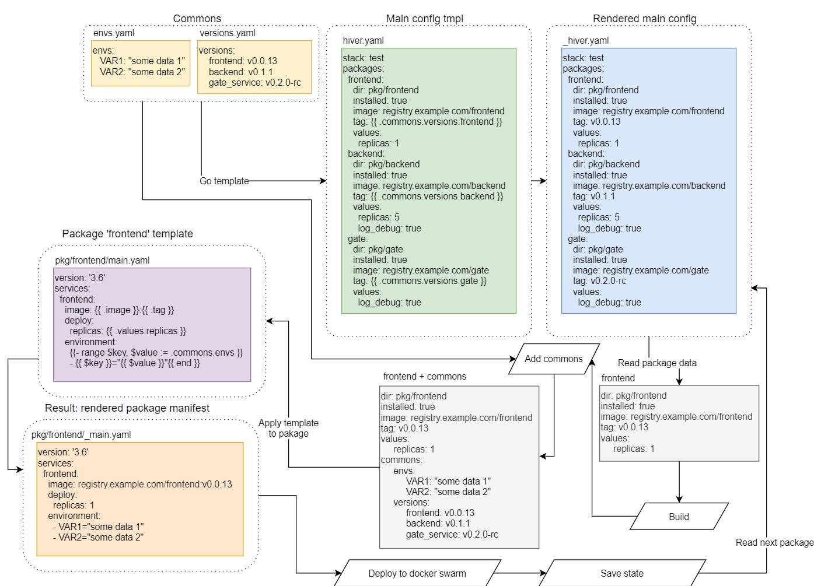

# Hiver - template-based configuration management for Docker swarm

Represents a way to describe infrastructure as code for docker swarm clusters.

- build images
- auth registry
- push images
- apply templates to manifests (render)
- deploy rendered manifest to docker swarm

The structural unit of Hyver's code is a package.
Packages are described in the main config in yaml format.

## Main config

Yaml manifest, which describes:

- stack name
- list of registers for authorization
- packages builds and deploys

By default, Hiver tries to use "./hiver.yaml" as main config. You can specify the file name using the "-f path/to/file.yaml" option.
Templates are allowed in the main config. See "extra templating" or “common” concept.

Example:
hiver.yaml

```yaml
# stack: stack name “example” (will be used as a
# stack name in docker stack deploy command)  
# required
stack: example

# List of registries for authorization.
# In this example, the environment variable
# is used instead of plain text password.  
# optional
registries:
  - url: registry.example.com
    user: username
    pass: {{ env DOCKER_PASS }}

# packages list
# required
packages:
  # package name
  hello_world:
    # the directory where the main package
    # manifest is located.
    # The manifest file name must be “main.yaml”
    # required
    dir: hello_world/
    # bool opt. If true - package will be deployed.
    # If false - all services contained in the package will be removed.
    # required
    installed: false
    # Build - describe image(s) builds.
    # Optional.
    build:
        # Option 'type: dockerfile': run docker build and push for
        # image:tag (in this example registry.example.com/hello-world:v0.0.1) in "dir"
        # If used 'dockerfile' - package options 'image:'' and 'tag:'' are required.
        # Option 'type: script': described in package 'hello_world_script_build' below.
        type: dockerfile
        # Directory with Dockerfile or build script.
        # required
        dir: builds/hello_world
        check: true
    # image name and tag, сan be used in package templates. 
    # optional, required only for build type “dockerfile”
    image: registry.example.com/hello-world
    tag: v0.0.1
    # an arbitrary data structure for use in package templates
    # optional
    values:
      replicas:
        count: 1
  # Describe script build. 
  hello_world_script_build:
    dir: hello_world/
    installed: true
    image: registry.example.com/hello-world
    tag: v0.0.2
    build:
        type: script
        # build directory
        dir: builds/hello_world
        # build script (in build directory)
        script: build.sh
        # additional args
        args: "some_info"
    # In this case will be run command:
    # cd builds/hello_world && ./build.sh registry.example.com/hello-world v0.0.2 some_info
    # image and tag options are not required. If they are not set command will look like:
    # cd builds/hello_world && ./build.sh some_info
```

## Commons:

User data in yaml format. Commons will be applied for templating main config and then for package configs.
Usages ```{{ .commons.some.data }}``` (see examples for details).
To add commons use option```-c commons1.yaml { -c commons2.yaml } ...```

## Options

```
-f file.yaml - define main configuration manifest

-c commons.yaml [ -c commons2.yaml ] - defile one or more commons files.

-p package1_name [ -p package2_name ] - run for specified packages only.

-dry-run - dry-run mode. Nothing will be deployed and built. Only show what needs do.    Also show packages diffs with previously applied packages configuration.

-debug - full debug output.
```

## States

After building, applying templates, and deploying the package, Hiver saves the last applied configuration as a state. At the next start, it compares the current configuration with the state and shows the difference before applying. Use the dry-run to only see the changes that will be applied.
The states are saved only locally and are for informational purposes only. States do not affect the operations of thehiver.

## Logic diagram

